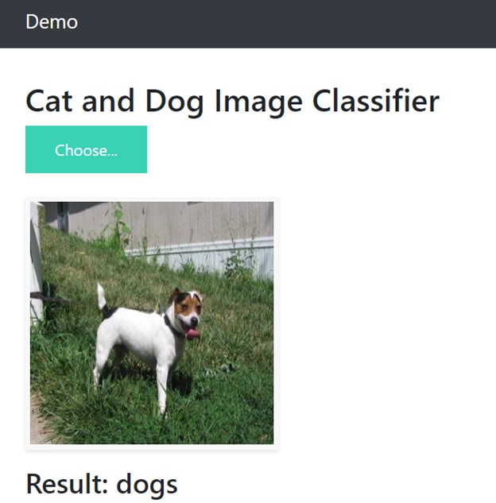
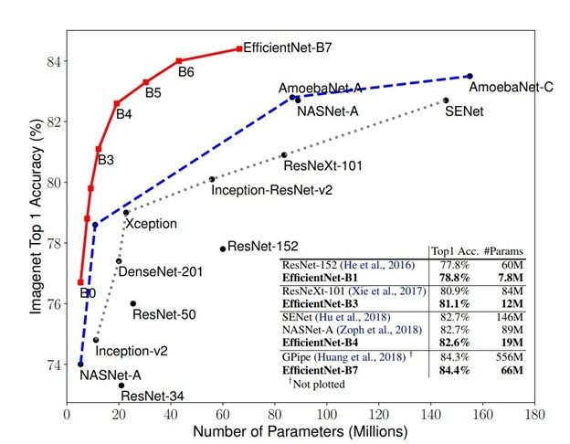

### Installation

		•	Windows, Linux or macOS with Python ≥ 3.6
		•	numpy
		•	pillow
		•	torchvision
		•	scikit-learn
		•	flask
		•	werkzeug
		•	torch==1.7.0+cpu

For Installation all the requirements kindly run:

		pip install -r requirements.txt --find-links=https://download.pytorch.org/whl/torch_stable.html

### Training & Evaluation in Command Line
To train and evaluate the model use " train_validator.py ", For details of the command line arguments, see train_validator.py -h or look at its source code to understand its behavior. Some common arguments are:

		•	--train_dir: Train dataset directory for example: dataset/training_set/
		•	--test_dir: Test dataset directory for example: dataset/test_set/
		•	--epochs: Number of iterations for training (default:100)
		•	--batch_size: Batch size for training (default:16)
		•	--gpu: Gpu enable training and testing
		•	--resume: path to latest checkpoint (default: none)
		•	--only_validation: For doing only validation, path to latest checkpoint (default: none)

#### Training the model:

		python train_validator.py --train_dir=dataset/training_set/ --test_dir=dataset/test_set/

Download the pretrained weights from here [Dropbox](https://www.dropbox.com/s/2ujfug11x5mdg78/model_best.pth.tar?dl=0)
#### Resume the Training:

		python train_validator.py --train_dir=dataset/training_set/ --test_dir=dataset/test_set/ --resume=weight/model_best.pth.tar

#### Testing Only:

		python train_validator.py --train_dir=dataset/training_set/ --test_dir=dataset/test_set/ --only_validation=weight/model_best.pth.tar

### Flask Based Deployment:
For interactive testing and visualization results, run the code
		
		python app.py

Then open the http://127.0.0.1:5000/

### Results

I have use efficientnet-b0 model because it achieves both higher accuracy and better efficiency over existing CNNs, reducing parameter size and FLOPS by an order of magnitude. The weights are available in the directory weights/model_best.pth.tar to test the model on test data, below are the results achieved.

Average Validation Accuracy: 95.2

||Cat	|Dog|
|-----|-----|-----|
|Precision|	0.957|	0.947|
|Recall	|0.946|	0.958|
|F-score|	0.952	|0.952|
